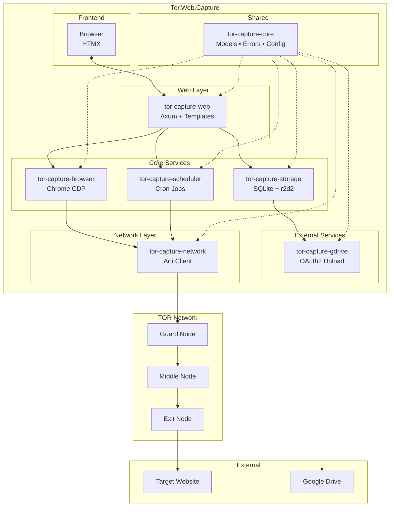
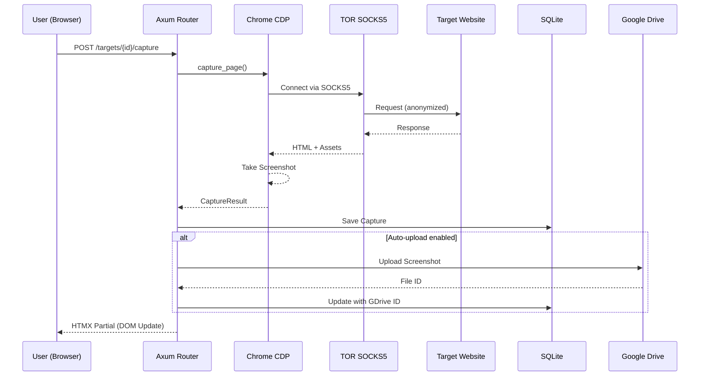
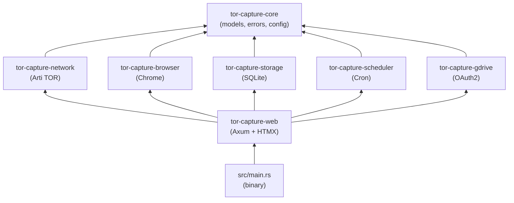
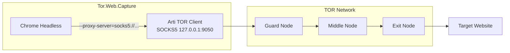
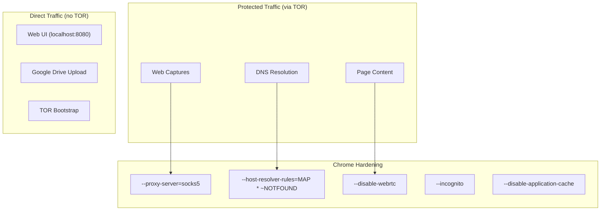

# Tor.Web.Capture

A Rust application for capturing web pages via TOR with an integrated web interface.

## Features

- **Integrated TOR Client** - Uses Arti (Rust TOR implementation) for native TOR connectivity
- **Web Interface** - Dynamic HTMX-powered dashboard for managing captures
- **Screenshot + HTML Capture** - Full page screenshots and HTML source via headless Chrome
- **IoT Bot User-Agents** - Shodan, Censys, ZGrab, Masscan, Nmap, and 10+ others
- **Scheduled Captures** - Cron-based scheduling for automated captures
- **Google Drive Upload** - OAuth2 and Service Account support
- **SQLite Storage** - Local database for targets, captures, and configuration
- **Security-First** - DNS via TOR, WebRTC disabled, circuit isolation

## Requirements

- Rust 1.75+
- Chromium or Google Chrome
- Linux (tested on Ubuntu 22.04+)

## Installation

```bash
# Clone the repository
git clone https://github.com/youruser/Tor.Web.Capture.git
cd Tor.Web.Capture

# Build
cargo build --release

# Run
cargo run --release
# Or directly:
./target/release/tor.web.capture
```

## Configuration

Configuration file: `config/default.toml`

```toml
[web]
bind_address = "127.0.0.1"
port = 8080

[tor]
enabled = true
data_dir = "./data/tor"
new_circuit_per_capture = true

[capture]
storage_path = "./data/captures"
max_concurrent_captures = 3
default_viewport_width = 1920
default_viewport_height = 1080

[storage]
database_path = "./data/tor-capture.db"

[gdrive]
enabled = false
auto_upload = false
```

## Usage

1. Start the application:
   ```bash
   cargo run --release
   ```

2. Open your browser to `http://127.0.0.1:8080`

3. Add a target URL to capture

4. Click "Capture" or set up a schedule

## Architecture



## Capture Flow



## Crate Dependencies



## Project Structure

```
Tor.Web.Capture/
├── src/main.rs                   # Entry point
├── config/default.toml           # Configuration
├── static/                       # CSS, JS assets
├── data/                         # Database, captures, TOR data
└── crates/
    ├── tor-capture-core/         # Models, errors, config
    ├── tor-capture-network/      # Arti TOR client wrapper
    ├── tor-capture-browser/      # Chrome headless capture
    ├── tor-capture-storage/      # SQLite repositories
    ├── tor-capture-gdrive/       # Google Drive integration
    ├── tor-capture-scheduler/    # Cron job scheduler
    └── tor-capture-web/          # Axum web server + HTMX
```

## IoT User-Agents

The following scanner user-agents are available:

| Scanner | Category |
|---------|----------|
| Shodan | IoT Scanner |
| Censys | Security Scanner |
| ZGrab | Security Scanner |
| Masscan | IoT Scanner |
| Nmap NSE | Security Scanner |
| BinaryEdge | IoT Scanner |
| FOFA | IoT Scanner |
| ZoomEye | IoT Scanner |
| GreyNoise | Security Scanner |
| Shadowserver | Security Scanner |
| SecurityTrails | Security Scanner |
| Onyphe | Security Scanner |
| IPinfo | Security Scanner |

## API Endpoints

### Web Interface (HTMX)

| Method | Route | Description |
|--------|-------|-------------|
| GET | `/` | Dashboard |
| GET | `/targets` | List targets |
| POST | `/targets` | Create target |
| POST | `/targets/{id}/capture` | Trigger capture |
| GET | `/captures` | List captures |
| GET | `/captures/{id}/screenshot` | Download screenshot |
| GET | `/schedules` | List schedules |
| GET | `/settings` | Settings page |

### REST API (JSON)

| Method | Route | Description |
|--------|-------|-------------|
| GET | `/api/v1/status` | Application status |
| GET | `/api/v1/targets` | List all targets |
| POST | `/api/v1/targets` | Create target |
| GET | `/api/v1/captures` | List captures |
| GET | `/api/v1/user-agents` | List user agents |

## Security

### Embedded TOR Client

The application embeds its own TOR client via **Arti** (pure Rust TOR implementation). No external TOR daemon required.



### Traffic Isolation



### Anti-Leak Protections

| Protection | Chrome Flag | Purpose |
|------------|-------------|---------|
| **SOCKS5 Proxy** | `--proxy-server=socks5://127.0.0.1:9050` | Route all traffic via TOR |
| **DNS via TOR** | `--host-resolver-rules=MAP * ~NOTFOUND, EXCLUDE localhost` | Prevent DNS leaks |
| **WebRTC Disabled** | `--disable-webrtc` + `--disable-features=WebRTC` | Prevent IP leaks |
| **No Cache** | `--disable-application-cache` + `--aggressive-cache-discard` | No persistent data |
| **Incognito** | `--incognito` | No cookies/history |
| **Circuit Isolation** | New circuit per capture (configurable) | Prevent correlation |

### What Goes Through TOR

| Traffic Type | Via TOR | Notes |
|--------------|---------|-------|
| Web captures (screenshot/HTML) | Yes | All target requests |
| DNS resolution | Yes | Forced via SOCKS5 |
| Page assets (JS, CSS, images) | Yes | All resources |
| Web UI (localhost) | No | Local only |
| Google Drive uploads | No | Direct connection |
| TOR bootstrap | No | Initial consensus download |

## License

MIT License
